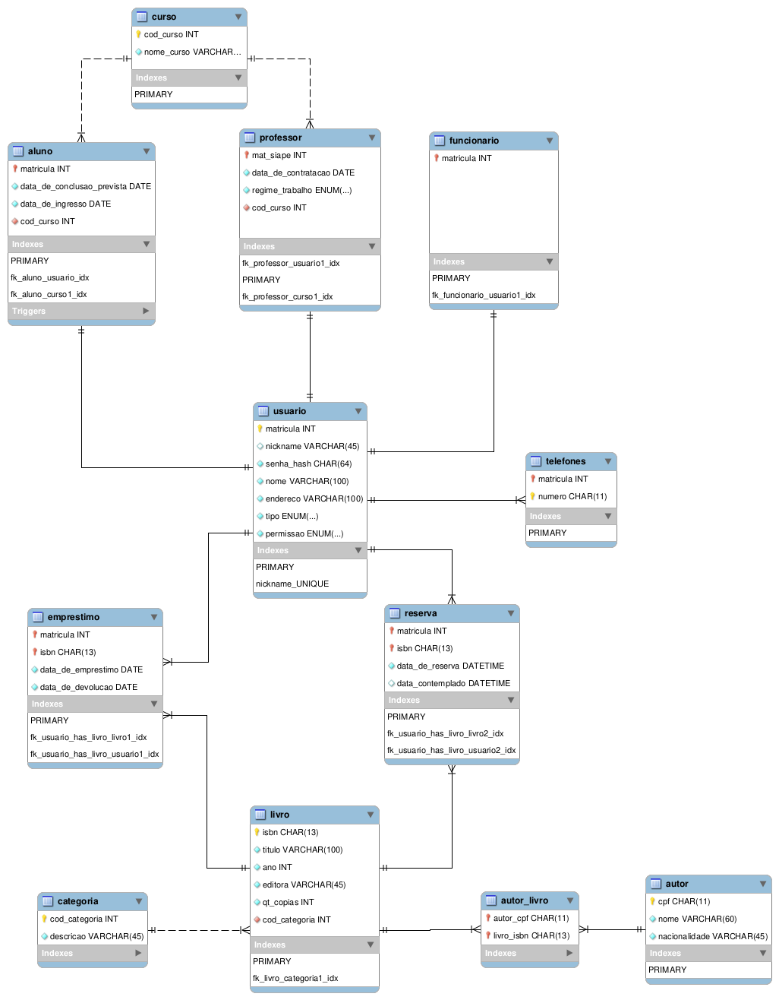

# Sistema de Biblioteca TECA

+ Linguagem de Programação: Python3.7
+ Banco de Dados: MySQL 8.0.12
+ Sistema de Modelagem: MySQL Workbench 8.0.13

# Modelo

O modelo conceitual feito no MySQL Workbench pode ser visualizado na
seguinte imagem:

